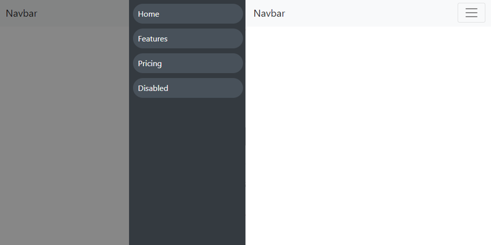

# navbar-bootstrap4-drawer-responsive

#Convert the Bootstrap 4 menu to the mobile drop-down menu

#Just ``` <span class="collapse-bg"></span> ``` added to navbar For the background behind the drop-down menu


